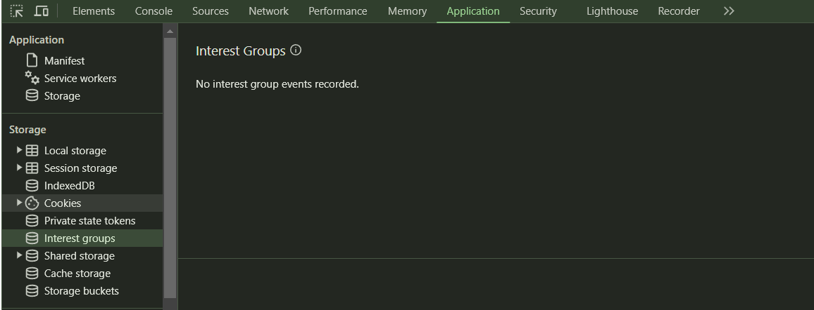

This JavaScript code consists of three asynchronous functions: `createTodo`, `getTodo`, and `mainFunc`. These functions interact with a placeholder API (`jsonplaceholder.typicode.com`) that simulates a RESTful backend for testing and prototyping.

### 1. `createTodo` Function
```javascript
const createTodo = async (todo) => {
    let options = {
        method: "POST",
        headers: {
            "Content-type": "application/json"
        },
        body: JSON.stringify(todo),
    }
    let p = await fetch('https://jsonplaceholder.typicode.com/posts', options)
    let response = await p.json()
    return response
}
```
- **Purpose:** This function creates a new "to-do" item by sending a POST request to the API.
- **Parameters:** It takes a `todo` object as input, which includes properties like `title`, `body`, and `userId`.
- **Options Object:** 
  - `method: "POST"` specifies that this is a POST request.
  - `headers: { "Content-type": "application/json" }` sets the content type to JSON, meaning the server expects JSON-formatted data.
  - `body: JSON.stringify(todo)` converts the `todo` object into a JSON string to be sent in the request body.
- **Fetch Request:** 
  - The `fetch` function sends the POST request to `'https://jsonplaceholder.typicode.com/posts'` with the specified options.
  - The `await` keyword ensures that the function waits for the response before moving on.
- **Response Handling:**
  - `let response = await p.json()` converts the response from the server to a JavaScript object.
  - The function then returns this `response` object.

### 2. `getTodo` Function
```javascript
const getTodo = async (id) => {
    let response = await fetch('https://jsonplaceholder.typicode.com/posts/' + id)
    let r = await response.json()
    return r
}
```
- **Purpose:** This function retrieves a specific "to-do" item by its ID.
- **Parameters:** It takes an `id` as input, which is the identifier for the to-do item.
- **Fetch Request:**
  - The `fetch` function sends a GET request to `'https://jsonplaceholder.typicode.com/posts/' + id`, where `id` is appended to the URL to specify which item to retrieve.
  - `let response = await fetch(...)` waits for the response from the server.
- **Response Handling:**
  - `let r = await response.json()` converts the response data to a JavaScript object.
  - The function returns this object, which contains the details of the requested to-do item.

### 3. `mainFunc` Function
```javascript
const mainFunc = async () => {
    let todo = {
        title: 'Harry2',
        body: 'bhai2',
        userId: 1100,
    }
    let todor = await createTodo(todo)
    console.log(todor)
    console.log(await getTodo(101))
}
```
- **Purpose:** This is the main function that orchestrates the execution of the `createTodo` and `getTodo` functions.
- **Todo Object:** 
  - It defines a `todo` object with a `title`, `body`, and `userId`.
- **Creating a To-Do:**
  - `let todor = await createTodo(todo)` creates a new to-do using the `createTodo` function and waits for the result.
  - `console.log(todor)` prints the response from the `createTodo` function, showing the details of the newly created to-do item.
- **Fetching a To-Do:**
  - `console.log(await getTodo(101))` fetches and prints the to-do item with ID `101` using the `getTodo` function.

### 4. Execution
```javascript
mainFunc()
```
- The `mainFunc` function is called, initiating the process of creating and fetching to-do items.

### Summary
- **createTodo:** Sends a POST request to create a new to-do item.
- **getTodo:** Sends a GET request to retrieve a specific to-do item by ID.
- **mainFunc:** Demonstrates creating a to-do item and then fetching an existing one, printing both to the console.


**Synchronous** and **asynchronous** programming are two different approaches to handling tasks and operations in a program, particularly when dealing with I/O operations (like reading files, making network requests, or accessing databases) or any tasks that may take some time to complete. Here's a comparison of the two:

### Synchronous Programming

**1. Execution Flow:**
   - In synchronous programming, tasks are executed one after the other, in a sequential order. 
   - Each task waits for the previous one to complete before starting.
   - If a task takes a long time (e.g., reading a large file), the program will pause and wait until the task is finished before moving on to the next one.

**2. Blocking Behavior:**
   - Synchronous code is typically **blocking**. This means that when a task is being executed, the entire program might stop and wait for that task to complete before it can continue executing the next line of code.
   - Example: 
     ```javascript
     function getData() {
         // Simulate a long-running task
         let data = readFileSync('data.txt');  // This will block until the file is read
         console.log(data);
     }
     console.log('Before getData');
     getData();
     console.log('After getData');  // This will run only after getData finishes
     ```

**3. Simplicity:**
   - Synchronous programming is often simpler to write and reason about because the flow of control is straightforward.

**4. Performance:**
   - Synchronous code can lead to performance bottlenecks, especially in situations where multiple tasks need to be performed concurrently. If a program is waiting on a slow operation, the entire program can become unresponsive.

### Asynchronous Programming

**1. Execution Flow:**
   - In asynchronous programming, tasks are executed independently of the main program flow.
   - When an asynchronous task is initiated, the program does not wait for it to complete. Instead, it moves on to execute the next task.
   - Once the asynchronous task is complete, the program is notified (usually through callbacks, promises, or async/await), and any associated code is then executed.

**2. Non-Blocking Behavior:**
   - Asynchronous code is typically **non-blocking**. The program continues executing other tasks while waiting for the asynchronous operation to complete.
   - Example:
     ```javascript
     async function getData() {
         let data = await readFile('data.txt');  // This will not block other operations
         console.log(data);
     }
     console.log('Before getData');
     getData();  // getData is initiated, but the program doesn't wait for it to finish
     console.log('After getData');  // This runs immediately after getData is called
     ```

**3. Complexity:**
   - Asynchronous programming can be more complex, especially when dealing with multiple tasks that depend on each other. This can lead to "callback hell" or make it harder to follow the program's logic.

**4. Performance:**
   - Asynchronous code can greatly improve performance, especially in I/O-bound or highly concurrent applications, by allowing multiple tasks to run concurrently without blocking the main program.

### Key Differences

| Aspect                | Synchronous Programming               | Asynchronous Programming          |
|-----------------------|----------------------------------------|-----------------------------------|
| Execution             | Sequential, one task at a time         | Concurrent, multiple tasks can run simultaneously |
| Blocking Behavior     | Blocking                               | Non-blocking                      |
| Complexity            | Simpler and easier to understand       | More complex, harder to manage    |
| Performance           | Can cause bottlenecks                  | Improves performance in I/O-bound tasks |
| Use Case              | Suitable for simple, linear tasks      | Suitable for I/O-bound, time-consuming tasks, and concurrency |

### When to Use Each

- **Synchronous Programming:**
  - Use when tasks are simple, quick, and need to be executed in a strict sequence.
  - Ideal for CPU-bound tasks where tasks don’t involve waiting on external resources like network or file I/O.

- **Asynchronous Programming:**
  - Use when tasks involve I/O operations, such as network requests, reading files, or databases, especially when you need the program to remain responsive.
  - Ideal for scenarios where you want to handle multiple operations at the same time without blocking the main thread of execution.


In JavaScript, particularly when dealing with web development and making HTTP requests, there are several methods (also called HTTP methods) that are commonly used. These methods define the type of action that should be performed on a given resource (like a web page or API endpoint). Here’s an overview of the main HTTP methods and how they work in JavaScript:

### 1. **GET**
   - **Purpose:** Retrieve data from a server.
   - **Usage:** Used to request data from a specified resource, like fetching a web page or getting data from an API.
   - **Characteristics:** 
     - Typically doesn’t alter the state of the server.
     - Parameters are often passed in the URL as query strings.
     - Safe and idempotent, meaning repeated requests should have the same effect as a single request.
   - **Example:**
     ```javascript
     fetch('https://jsonplaceholder.typicode.com/posts/1')
       .then(response => response.json())
       .then(data => console.log(data))
       .catch(error => console.error('Error:', error));
     ```

### 2. **POST**
   - **Purpose:** Send data to the server to create a new resource.
   - **Usage:** Commonly used for submitting form data or creating a new entry in a database.
   - **Characteristics:** 
     - The request body contains the data to be sent to the server.
     - It’s not idempotent; multiple requests can result in different outcomes.
   - **Example:**
     ```javascript
     const newPost = {
       title: 'New Post',
       body: 'This is the body of the new post.',
       userId: 1
     };

     fetch('https://jsonplaceholder.typicode.com/posts', {
       method: 'POST',
       headers: {
         'Content-Type': 'application/json'
       },
       body: JSON.stringify(newPost)
     })
     .then(response => response.json())
     .then(data => console.log(data))
     .catch(error => console.error('Error:', error));
     ```

### 3. **PUT**
   - **Purpose:** Update an existing resource entirely.
   - **Usage:** Used to update the data of a specific resource, typically replacing it with new data.
   - **Characteristics:** 
     - The entire resource is updated with the data provided in the request.
     - Idempotent, meaning multiple identical requests should have the same effect as a single one.
   - **Example:**
     ```javascript
     const updatedPost = {
       title: 'Updated Post',
       body: 'This is the updated body of the post.',
       userId: 1
     };

     fetch('https://jsonplaceholder.typicode.com/posts/1', {
       method: 'PUT',
       headers: {
         'Content-Type': 'application/json'
       },
       body: JSON.stringify(updatedPost)
     })
     .then(response => response.json())
     .then(data => console.log(data))
     .catch(error => console.error('Error:', error));
     ```

### 4. **PATCH**
   - **Purpose:** Partially update an existing resource.
   - **Usage:** Used when you want to update only certain fields of a resource, rather than replacing the entire resource like with `PUT`.
   - **Characteristics:** 
     - Only the fields provided in the request are updated.
     - Idempotent, like `PUT`.
   - **Example:**
     ```javascript
     const partialUpdate = {
       title: 'Partially Updated Title'
     };

     fetch('https://jsonplaceholder.typicode.com/posts/1', {
       method: 'PATCH',
       headers: {
         'Content-Type': 'application/json'
       },
       body: JSON.stringify(partialUpdate)
     })
     .then(response => response.json())
     .then(data => console.log(data))
     .catch(error => console.error('Error:', error));
     ```

### 5. **DELETE**
   - **Purpose:** Delete a specified resource.
   - **Usage:** Used to remove a resource from the server.
   - **Characteristics:** 
     - This action removes the specified resource from the server.
     - Idempotent, meaning multiple identical requests should have the same effect as a single one.
   - **Example:**
     ```javascript
     fetch('https://jsonplaceholder.typicode.com/posts/1', {
       method: 'DELETE'
     })
     .then(response => {
       if (response.ok) {
         console.log('Post deleted');
       }
     })
     .catch(error => console.error('Error:', error));
     ```

### 6. **OPTIONS**
   - **Purpose:** Describe the communication options for the target resource.
   - **Usage:** Often used in CORS (Cross-Origin Resource Sharing) scenarios to determine what HTTP methods and headers are allowed by the server.
   - **Characteristics:** 
     - Does not change the state of the resource.
     - Often used by browsers automatically before a request is made.
   - **Example:**
     ```javascript
     fetch('https://jsonplaceholder.typicode.com/posts', {
       method: 'OPTIONS'
     })
     .then(response => {
       console.log(response.headers.get('Allow'));
     })
     .catch(error => console.error('Error:', error));
     ```

### 7. **HEAD**
   - **Purpose:** Retrieve the headers of a resource, without the body.
   - **Usage:** Used when you want to check the headers (like content type, content length) before fetching the resource.
   - **Characteristics:** 
     - Similar to `GET`, but the response does not contain the body.
     - Useful for checking what a `GET` request will return without actually retrieving the data.
   - **Example:**
     ```javascript
     fetch('https://jsonplaceholder.typicode.com/posts/1', {
       method: 'HEAD'
     })
     .then(response => {
       console.log(response.headers.get('Content-Type'));
     })
     .catch(error => console.error('Error:', error));
     ```

### 8. **TRACE**
   - **Purpose:** Echoes the received request so that a client can see what changes or additions might have been made by intermediate servers.
   - **Usage:** Rarely used in practice; primarily used for diagnostic purposes to trace the path a request takes to reach the server.
   - **Characteristics:** 
     - The server responds with the exact request it received.
     - Can expose information about the path taken to the server.
   - **Note:** For security reasons, many servers disable or reject `TRACE` requests.

### 9. **CONNECT**
   - **Purpose:** Establishes a tunnel to the server identified by the target resource.
   - **Usage:** Typically used with proxies that can dynamically switch to being a tunnel (e.g., SSL tunneling).
   - **Characteristics:** 
     - Opens a TCP connection for tunneling, typically for SSL encryption.
     - Used in HTTP proxies to create an encrypted tunnel to the destination server.

These methods are part of the HTTP protocol and are crucial for building and interacting with RESTful APIs in JavaScript. The most commonly used methods are `GET`, `POST`, `PUT`, `PATCH`, and `DELETE`, as they cover the core CRUD (Create, Read, Update, Delete) operations needed for most web applications.

### Local Storage 




# Practice Set

### Q1: Use a Free API From The Internet And Feed Your App With Live Data

You've already done this by fetching data from the "kontests.net" API and displaying it on the page. Here’s a quick explanation:

- **Fetching Data**: 
   ```javascript
   let response = fetch(url)
   ```
   You use the `fetch` API to get data from the specified URL. This returns a promise that resolves to the response object.

- **Handling JSON**:
   ```javascript
   response.then((v) => {
       return v.json()
   })
   ```
   Once the data is fetched, you convert it to JSON format, which is a structured format to represent data.

- **Displaying Data**:
   ```javascript
   for (item in contests) {
       // Creating HTML dynamically
       ihtml += `
           <div class="card mx-2 my-2" style="width: 22rem;">
               
               <div class="card-body">
                   <h5 class="card-title">${contests[item].name}</h5>
                   <p class="card-text"> Status is ${contests[item].status} and site is ${contests[item].site}</p>
                   <p class="card-text"> In 24 Hours? ${contests[item].in_24_hours} </p>
                   <p>Starts at: ${contests[item].start_time}</p>
                   <p>Ends at: ${contests[item].end_time}</p>
                   <a href="${contests[item].url}" class="btn btn-primary my-4">Visit Contest</a>
               </div>
           </div>
       `;
   }
   cardContainer.innerHTML = ihtml;
   ```
   You loop through the contests, create HTML for each contest, and inject it into the page.

### Q2: Create A Note-Saving App Which Stores Your Note To localStorage

You’ve implemented the storage part where the note is saved to `localStorage`:

- **Prompting for a Note**:
   ```javascript
   let a = prompt("Enter your note")
   if (a) {
       localStorage.setItem("note", a)
   }
   ```
   The app prompts the user to enter a note, which is then saved in the `localStorage` under the key `"note"`.

### Q3: Repeat Q2 And Fetch The Note Which User Entered In The Previous Question

You’ve also implemented fetching the note:

- **Retrieving the Note**:
   ```javascript
   let n = localStorage.getItem("note")
   alert("Your note is " + n)
   ```
   The note stored in `localStorage` is fetched using `getItem` and displayed using an alert.

### Q4: Delete The Note In The Previous Question

Finally, you’ve implemented the deletion of the note:

- **Confirm and Delete**:
   ```javascript
   let c = confirm("Do you want to delete your note?")
   if (c) {
       localStorage.removeItem("note")
       alert("Note deleted successfully!")
   }
   ```
   The app asks for confirmation from the user, and if confirmed, it deletes the note using `removeItem` and alerts the user that the note has been deleted.

### Complete Code Integration:

```javascript
// Q1: Fetch and display contests data
let url = "https://kontests.net/api/v1/all";
let response = fetch(url);
response.then((v) => {
    return v.json();
}).then((contests) => {
    console.log(contests);
    let ihtml = "";
    for (let item in contests) {
        console.log(contests[item]);
        ihtml += `
        <div class="card mx-2 my-2" style="width: 22rem;">
            
            <div class="card-body">
                <h5 class="card-title">${contests[item].name}</h5>
                <p class="card-text"> Status is ${contests[item].status} and site is ${contests[item].site}</p>
                <p class="card-text"> In 24 Hours? ${contests[item].in_24_hours} </p>
                <p>Starts at: ${contests[item].start_time}</p>
                <p>Ends at: ${contests[item].end_time}</p>
                <a href="${contests[item].url}" class="btn btn-primary my-4">Visit Contest</a>
            </div>
        </div>
        `;
    }
    cardContainer.innerHTML = ihtml;
});

/* ******************* NOTES APP (REMAINING QUESTIONS OF PRACTICE SET) *********** */

// Q2: Save a note to localStorage
let n = localStorage.getItem("note");
alert("Your note is " + n);

let a = prompt("Enter your note");
if (a) {
    localStorage.setItem("note", a);
}

// Q3: Fetch the saved note (covered in the alert above with Q2)

// Q4: Delete the note
let c = confirm("Do you want to delete your note?");
if (c) {
    localStorage.removeItem("note");
    alert("Note deleted successfully!");
}
```
