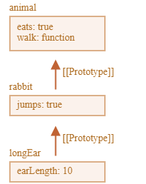

**Define a Constructor Function:**

```javascript
function Person(name, age) {
    this.name = name;
    this.age = age;
}
```

**Add a Method to the Constructor Function's Prototype:**

```javascript
Person.prototype.sayHello = function() {
    console.log(`Hello, my name is ${this.name} and I'm ${this.age} years old.`);
};
```

**Create a New Object Using the Constructor Function:**

```javascript
const person1 = new Person("Alice", 30);
```

**Call the Method on the Object:**

```javascript
person1.sayHello(); // Output: "Hello, my name is Alice and I'm 30 years old."
```

---

## Prototypal Inheritance.


```javascript
// Define a constructor function 
function Person(name, age) {
 this.name = name;
 this.age = age;
}
 
// Add a method to the constructor function's prototype 
Person.prototype.sayHello = function() {
 console.log("Hello, my name is " + this.name + " and I'm " + this.age + " years old.");
};
 
// Create a new object using the constructor function 
var person1 = new Person("Alice", 30);

// Call the method on the object 
person1.sayHello(); // output: "Hello, my name is Alice and I'm 30 years old.
```

**Object-Oriented Programming in JavaScript with Examples [Updated 2024]**

Object-Oriented Programming (OOP) in JavaScript is a paradigm focused on objects rather than functions. Unlike procedural programming, which structures programs as a sequence of logical steps, OOP models complex systems as interactive objects.

This guide explores the core principles of OOP in JavaScript with practical examples.

### Fundamentals of OOP in JavaScript

1. **Objects and Classes**
   - An object in JavaScript is a standalone entity with properties and a type.

   ```javascript
   const dog = {
       breed: 'Labrador',
       color: 'black',
       bark() {
           console.log('Woof!');
       }
   };
   dog.bark(); // Output: Woof!
   ```

   - Classes, introduced in ES6, serve as templates for creating objects.

   ```javascript
   class Animal {
       constructor(name) {
           this.name = name;
       }
       speak() {
           console.log(`${this.name} makes a noise.`);
       }
   }
   const animal = new Animal('Dog');
   animal.speak(); // Output: Dog makes a noise.
   ```

2. **Encapsulation**
   - Encapsulation involves hiding an object's internal representation from the outside.

   ```javascript
   class Car {
       constructor(brand) {
           this._brand = brand;
       }
       get brand() {
           return this._brand;
       }
       set brand(newBrand) {
           this._brand = newBrand;
       }
   }
   const myCar = new Car('Ford');
   console.log(myCar.brand); // Output: Ford
   myCar.brand = 'BMW';
   console.log(myCar.brand); // Output: BMW
   ```

3. **Inheritance**
   - Inheritance allows a class to inherit properties and methods from another class.

   ```javascript
   class Animal {
       constructor(name) {
           this.name = name;
       }
       speak() {
           console.log(`${this.name} makes a noise.`);
       }
   }
   class Dog extends Animal {
       speak() {
           console.log(`${this.name} barks.`);
       }
   }
   const d = new Dog('Mitzie');
   d.speak(); // Output: Mitzie barks.
   ```

4. **Polymorphism**
   - Polymorphism enables objects of different classes to be treated as instances of a common superclass.

   ```javascript
   class Animal {
       speak() {
           console.log('Animal speaks');
       }
   }
   class Cat extends Animal {
       speak() {
           console.log('Meow');
       }
   }
   class Dog extends Animal {
       speak() {
           console.log('Woof');
       }
   }
   function makeAnimalSpeak(animal) {
       animal.speak();
   }
   makeAnimalSpeak(new Cat()); // Output: Meow
   makeAnimalSpeak(new Dog()); // Output: Woof
   ```

5. **Abstraction**
   - Abstraction involves creating simple models to represent complex real-world objects.

   ```javascript
   class Vehicle {
       startEngine() {
           console.log('Engine started');
       }
       stopEngine() {
           console.log('Engine stopped');
       }
   }
   class Car extends Vehicle {
       startEngine() {
           console.log('Car engine started');
       }
   }
   const myCar = new Car();
   myCar.startEngine(); // Output: Car engine started
   ```

### Advanced OOP Concepts in JavaScript

6. **Constructors and the new Keyword**
   - Constructors are special functions for creating and initializing objects.

   ```javascript
   class Person {
       constructor(name, age) {
           this.name = name;
           this.age = age;
       }
   }
   const person = new Person('Alice', 25);
   console.log(person); // Output: Person { name: 'Alice', age: 25 }
   ```

7. **Methods — Instance, Static, and Prototype Methods**
   - Methods in JavaScript can be instance, static, or prototype methods.

   ```javascript
   class Rectangle {
       constructor(width, height) {
           this.width = width;
           this.height = height;
       }
       // Instance method
       getArea() {
           return this.width * this.height;
       }
       // Static method
       static compareArea(rect1, rect2) {
           return rect1.getArea() - rect2.getArea();
       }
   }
   const rect1 = new Rectangle(5, 8);
   const rect2 = new Rectangle(6, 7);
   console.log(Rectangle.compareArea(rect1, rect2)); // Output: -2
   ```

8. **Getters and Setters**
   - Getters and setters allow you to define Object Accessors (Computed Properties).

   ```javascript
   class Person {
       constructor(firstName, lastName) {
           this.firstName = firstName;
           this.lastName = lastName;
       }
       get fullName() {
           return `${this.firstName} ${this.lastName}`;
       }
       set fullName(name) {
           [this.firstName, this.lastName] = name.split(' ');
       }
   }
   const person = new Person('John', 'Doe');
   console.log(person.fullName); // Output: John Doe
   person.fullName = 'Jane Smith';
   console.log(person.fullName); // Output: Jane Smith
   ```

9. **Inheritance with extends and super**
   - The `extends` keyword is used to create a child class from a parent class.

   ```javascript
   class Shape {
       constructor(name) {
           this.name = name;
       }
       move() {
           console.log(`${this.name} moved`);
       }
   }
   class Circle extends Shape {
       constructor(radius) {
           super('Circle');
           this.radius = radius;
       }
   }
   const myCircle = new Circle(5);
   myCircle.move(); // Output: Circle moved
   ```

### Object-Oriented vs. Functional Programming in JavaScript

**Differences Between OOP and Functional Programming:**
- **State and Immutability:** OOP manages state within objects, which can change over time. Functional programming prefers immutable data structures and pure functions without side effects.
- **Methodology:** OOP models real-world entities using objects and classes, while functional programming focuses on computation and avoids changing state.
- **Code Reusability:** In OOP, reusability comes through inheritance and polymorphism. Functional programming achieves reusability through functions and higher-order functions.

**When to Use OOP or Functional Programming:**
- **Use OOP when:**
  - You’re dealing with a complex system with clearly defined types and relationships.
  - Your application’s state changes frequently and needs cohesive management.
  - You prefer a modular, structured approach to organizing code.

- **Use Functional Programming when:**
  - You need a system with operations that don’t depend on or alter the state.
  - Your focus is on data flow and transformations.
  - You aim for code that’s easy to test and reason about, thanks to its immutability and purity.

### Conclusion:
Object-oriented programming in JavaScript offers a powerful way to structure and organize code, especially for complex applications. Although it differs from functional programming, both paradigms have unique strengths and can be combined within a single project. Understanding both OOP and functional programming makes you a more versatile and effective JavaScript developer.

### Prototypal Inheritance.




Here's how you can approach each of these practice problems:

### Q1: Create a Class to Create a Complex Number. Create a Constructor to Set the Real and Imaginary Parts.
```javascript
class ComplexNumber {
    constructor(real, imaginary) {
        this.real = real;
        this.imaginary = imaginary;
    }
}

// Example usage:
let num1 = new ComplexNumber(3, 4); // Complex number: 3 + 4i
console.log(`Complex Number: ${num1.real} + ${num1.imaginary}i`);
```

### Q2: Write a Method to Add Two Complex Numbers in the Above Class.
```javascript
class ComplexNumber {
    constructor(real, imaginary) {
        this.real = real;
        this.imaginary = imaginary;
    }

    add(otherComplex) {
        return new ComplexNumber(
            this.real + otherComplex.real,
            this.imaginary + otherComplex.imaginary
        );
    }
}

// Example usage:
let num1 = new ComplexNumber(3, 4);
let num2 = new ComplexNumber(1, 2);
let sum = num1.add(num2);
console.log(`Sum: ${sum.real} + ${sum.imaginary}i`);
```

### Q3: Create a Class `Student` from a Class `Human`. Override a Method and See Changes.
```javascript
class Human {
    speak() {
        console.log("Hello, I am a human.");
    }
}

class Student extends Human {
    speak() {
        console.log("Hello, I am a student.");
    }
}

// Example usage:
let person = new Human();
person.speak(); // Output: "Hello, I am a human."

let student = new Student();
student.speak(); // Output: "Hello, I am a student."
```

### Q4: See if `Student` is an Instance of `Human` Using `instanceof` Keyword.
```javascript
console.log(student instanceof Human); // Output: true
console.log(student instanceof Student); // Output: true
console.log(person instanceof Student); // Output: false
```

### Q5: Use Getters and Setters to Set and Get the Real and Imaginary Parts of the Complex Number.
```javascript
class ComplexNumber {
    constructor(real, imaginary) {
        this._real = real;
        this._imaginary = imaginary;
    }

    get real() {
        return this._real;
    }

    set real(value) {
        this._real = value;
    }

    get imaginary() {
        return this._imaginary;
    }

    set imaginary(value) {
        this._imaginary = value;
    }
}

// Example usage:
let num = new ComplexNumber(5, 6);
console.log(`Before: ${num.real} + ${num.imaginary}i`);

num.real = 7; // Using setter
num.imaginary = 8; // Using setter

console.log(`After: ${num.real} + ${num.imaginary}i`); // Using getter
```

### Summary:
- **Q1**: We defined a `ComplexNumber` class with a constructor to initialize the real and imaginary parts.
- **Q2**: Added a method to sum two complex numbers.
- **Q3**: Demonstrated inheritance by creating a `Student` class from `Human` and overriding a method.
- **Q4**: Used the `instanceof` keyword to check if an object is an instance of a particular class.
- **Q5**: Implemented getters and setters to access and modify the real and imaginary parts of the complex number.