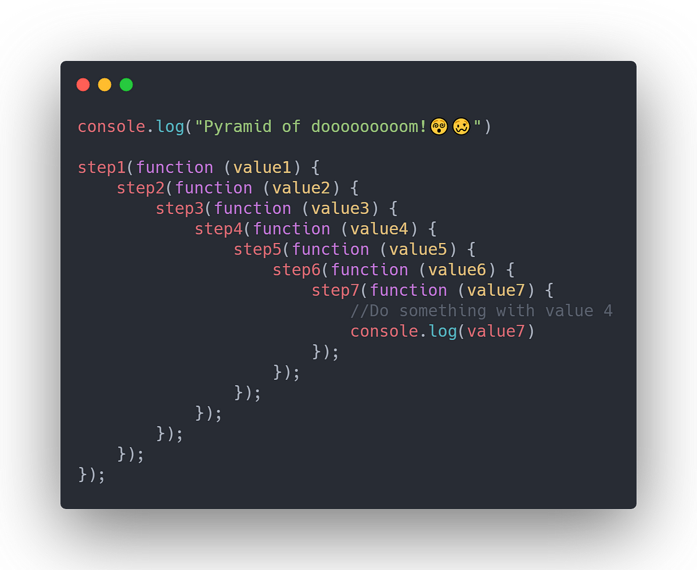

### Callback Functions and Error Handling in JavaScript

**Callback Functions**

In JavaScript, functions can be passed as arguments to other functions. These functions are called **callback functions**. A callback function is executed after the main function has finished executing. This is a common way to handle asynchronous operations.

**Example: Callback Function**

```javascript
function fetchData(callback) {
    setTimeout(() => {
        const data = { name: 'John', age: 30 };
        callback(data);
    }, 2000);
}

function displayData(data) {
    console.log(`Name: ${data.name}, Age: ${data.age}`);
}

fetchData(displayData);
```

In this example, `fetchData` simulates an asynchronous operation using `setTimeout`. Once the data is fetched, the `callback` function `displayData` is called with the fetched data.

**Error Handling with Callbacks**

When dealing with asynchronous operations, it is crucial to handle errors effectively. The convention in JavaScript is to pass an error object as the first argument to the callback function.

**Example: Error Handling with Callbacks**

```javascript
function fetchData(callback) {
    setTimeout(() => {
        const error = false; // Change to true to simulate an error
        const data = { name: 'John', age: 30 };

        if (error) {
            callback('Error: Unable to fetch data', null);
        } else {
            callback(null, data);
        }
    }, 2000);
}

function handleResponse(error, data) {
    if (error) {
        console.error(error);
    } else {
        console.log(`Name: ${data.name}, Age: ${data.age}`);
    }
}

fetchData(handleResponse);
```

In this example, the `fetchData` function simulates an asynchronous operation that might fail. If an error occurs, the callback is called with an error message; otherwise, it is called with the data.

**Best Practices for Callbacks and Error Handling**

1. **Always Handle Errors**: Ensure that every callback function is capable of handling errors gracefully.
2. **Avoid Callback Hell**: Refactor deeply nested callbacks using Promises or async/await.
3. **Clear and Descriptive Error Messages**: Provide meaningful error messages to help with debugging.

**Example: Refactoring with Promises**

To avoid the complexities of nested callbacks, you can use Promises, which provide a more elegant way to handle asynchronous operations and errors.

```javascript
function fetchData() {
    return new Promise((resolve, reject) => {
        setTimeout(() => {
            const error = false; // Change to true to simulate an error
            const data = { name: 'John', age: 30 };

            if (error) {
                reject('Error: Unable to fetch data');
            } else {
                resolve(data);
            }
        }, 2000);
    });
}

fetchData()
    .then(data => {
        console.log(`Name: ${data.name}, Age: ${data.age}`);
    })
    .catch(error => {
        console.error(error);
    });
```

In this example, `fetchData` returns a Promise. If the operation is successful, the Promise is resolved with the data. If an error occurs, the Promise is rejected with an error message. The `then` method handles the resolved data, and the `catch` method handles the error.

By using Promises, you can avoid callback hell and write cleaner, more readable code.

**Conclusion**

Callback functions are essential in JavaScript for handling asynchronous operations. Proper error handling in callbacks is crucial for building robust applications. Promises provide a more manageable alternative to callbacks, allowing you to write cleaner and more maintainable asynchronous code.

---

This section provides an overview of callback functions and error handling in JavaScript, along with best practices and examples for writing and refactoring asynchronous code.





The `loadScript` function you've provided is a nice example of how to load external scripts asynchronously using Promises in JavaScript. The function returns a Promise that resolves when the script is successfully loaded and rejects if there's an error during the loading process.

Here's the complete code including a continuation after the `p1.then` block:

```javascript
const loadScript = (src) => {
  return new Promise((resolve, reject) => {
    let script = document.createElement("script");
    script.type = "text/javascript";
    script.src = src;
    document.body.appendChild(script);

    script.onload = () => {
      resolve("Script has been loaded successfully");
    };

    script.onerror = () => {
      reject(new Error(`Failed to load script: ${src}`));
    };
  });
};

// Load the script and chain the promises
let p1 = loadScript("https://cdn.jsdelivr.net/npm/bootstrap@5.2.1/dist/js/bootstrap.bundle.min.js");

p1.then((value) => {
  console.log(value);
  // Loading another script after the first one is loaded
  return loadScript("https://cdn.jsdelivr.net/npm/bootstrap@5.2.1/dist/js/bootstrap.bundle.min.js");
})
.then((value) => {
  console.log(value);
  // You can continue chaining more scripts if needed
})
.catch((error) => {
  console.error("Script loading failed:", error);
});
```

### Explanation:

1. **loadScript Function**:
    - The `loadScript` function creates a new script element with the provided `src` URL and appends it to the document's body.
    - If the script loads successfully, the `onload` event triggers and resolves the Promise.
    - If the script fails to load, the `onerror` event triggers and rejects the Promise with an error.

2. **Chaining Promises**:
    - After the first script is loaded (`p1.then`), it returns another call to `loadScript`, loading the same script again.
    - You can chain as many `.then()` calls as needed to load multiple scripts sequentially.

3. **Error Handling**:
    - If any of the script loads fail, the `catch` block will handle the error, providing a descriptive message about what went wrong.


### 1. **Promise Chaining**:
- **True**: When you chain Promises using `.then()`, each Promise in the chain runs sequentially, meaning the next `.then()` is executed only after the previous one resolves.
- Example:
  ```javascript
  new Promise((resolve) => setTimeout(() => resolve("First"), 5000))
    .then((value) => {
      console.log(value);
      return new Promise((resolve) => setTimeout(() => resolve("Second"), 5000));
    })
    .then((value) => {
      console.log(value);
    });
  ```
  - If you have 10 chained Promises, each with a `setTimeout` of 5 seconds, the total execution time would be approximately 50 seconds (5 seconds for each).

### 2. **Attaching Multiple Handlers to a Promise**:
- **True**: You can attach multiple `.then()` handlers to the same Promise. These handlers will run independently of each other.
- Example:
  ```javascript
  let promise = new Promise((resolve) => setTimeout(() => resolve("Done"), 5000));

  promise.then((value) => {
    console.log("Handler 1: " + value);
  });

  promise.then((value) => {
    console.log("Handler 2: " + value);
  });
  ```
  - In this case, both handlers will run after the Promise resolves, and they'll run almost simultaneously. If you had 10 handlers attached to the same Promise, they would all execute after the initial 5-second delay, but they would not add any additional delay.

### **Summary**:
- **Promise Chaining**: Executes one after the other. Multiple chained Promises with a `setTimeout` of 5 seconds each will take 50 seconds in total if there are 10 Promises.
- **Multiple Handlers on the Same Promise**: These handlers run independently of each other. If you attach multiple handlers to a single Promise, and the Promise has a `setTimeout` of 5 seconds, all handlers will run in parallel after the 5 seconds, so the total time will be just 5 seconds.


### Static Methods of the `Promise` Class

1. **`Promise.all(promises)`**
   - **Explanation**: This method takes an array of Promises and waits for all of them to resolve. If all Promises resolve successfully, it returns an array of their results. If any one of the Promises rejects, `Promise.all` will immediately reject with that error, and all other results are ignored.
   - **Example**:
     ```javascript
     let promise1 = Promise.resolve(10);
     let promise2 = Promise.resolve(20);
     let promise3 = Promise.resolve(30);

     Promise.all([promise1, promise2, promise3])
       .then((results) => {
         console.log(results); // Output: [10, 20, 30]
       })
       .catch((error) => {
         console.error(error);
       });
     ```

2. **`Promise.allSettled(promises)`**
   - **Explanation**: This method waits for all Promises to settle (either resolved or rejected) and returns an array of objects. Each object has a `status` (either "fulfilled" or "rejected") and a `value` or `reason` depending on whether the Promise was fulfilled or rejected.
   - **Example**:
     ```javascript
     let promise1 = Promise.resolve(10);
     let promise2 = Promise.reject("Error occurred");
     let promise3 = Promise.resolve(30);

     Promise.allSettled([promise1, promise2, promise3])
       .then((results) => {
         console.log(results);
         // Output: [
         //   { status: "fulfilled", value: 10 },
         //   { status: "rejected", reason: "Error occurred" },
         //   { status: "fulfilled", value: 30 }
         // ]
       });
     ```

3. **`Promise.race(promises)`**
   - **Explanation**: This method waits for the first Promise to settle (either resolve or reject). The result or error of that first settled Promise becomes the output.
   - **Example**:
     ```javascript
     let promise1 = new Promise((resolve) => setTimeout(() => resolve("First"), 100));
     let promise2 = new Promise((resolve) => setTimeout(() => resolve("Second"), 200));

     Promise.race([promise1, promise2])
       .then((result) => {
         console.log(result); // Output: "First"
       })
       .catch((error) => {
         console.error(error);
       });
     ```

4. **`Promise.any(promises)`**
   - **Explanation**: This method waits for the first Promise that resolves successfully. If no Promise resolves and all are rejected, it throws an `AggregateError` with all the rejection reasons.
   - **Example**:
     ```javascript
     let promise1 = Promise.reject("Error 1");
     let promise2 = new Promise((resolve) => setTimeout(() => resolve("Success"), 100));
     let promise3 = Promise.reject("Error 2");

     Promise.any([promise1, promise2, promise3])
       .then((result) => {
         console.log(result); // Output: "Success"
       })
       .catch((error) => {
         console.error(error.errors); // Output: ["Error 1", "Error 2"]
       });
     ```

5. **`Promise.resolve(value)`**
   - **Explanation**: This method creates a Promise that is immediately resolved with the provided value.
   - **Example**:
     ```javascript
     let promise = Promise.resolve("Immediate resolve");

     promise.then((result) => {
       console.log(result); // Output: "Immediate resolve"
     });
     ```

6. **`Promise.reject(error)`**
   - **Explanation**: This method creates a Promise that is immediately rejected with the provided error.
   - **Example**:
     ```javascript
     let promise = Promise.reject("Immediate reject");

     promise.catch((error) => {
       console.error(error); // Output: "Immediate reject"
     });
     ```
